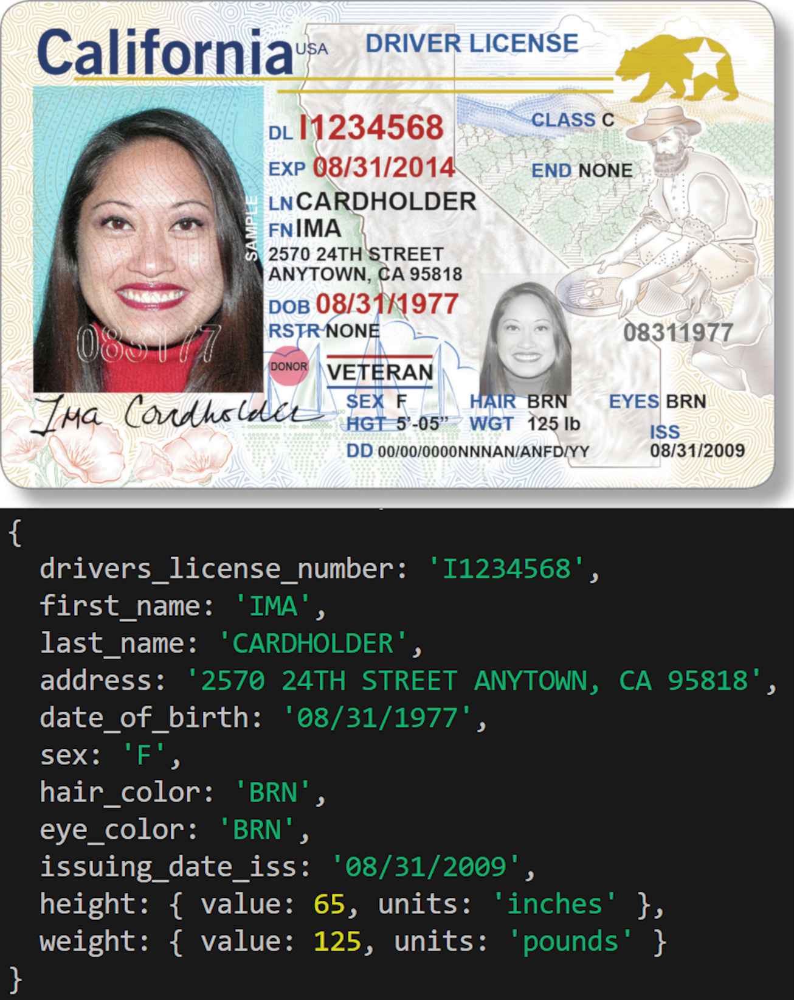
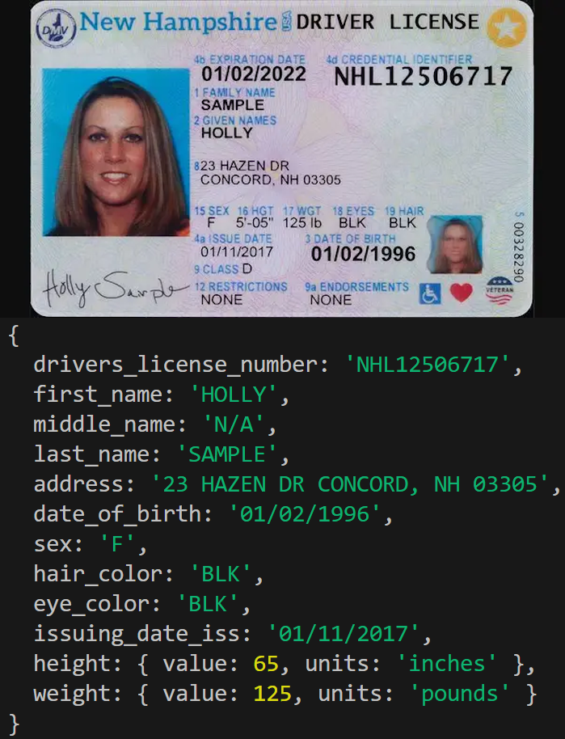
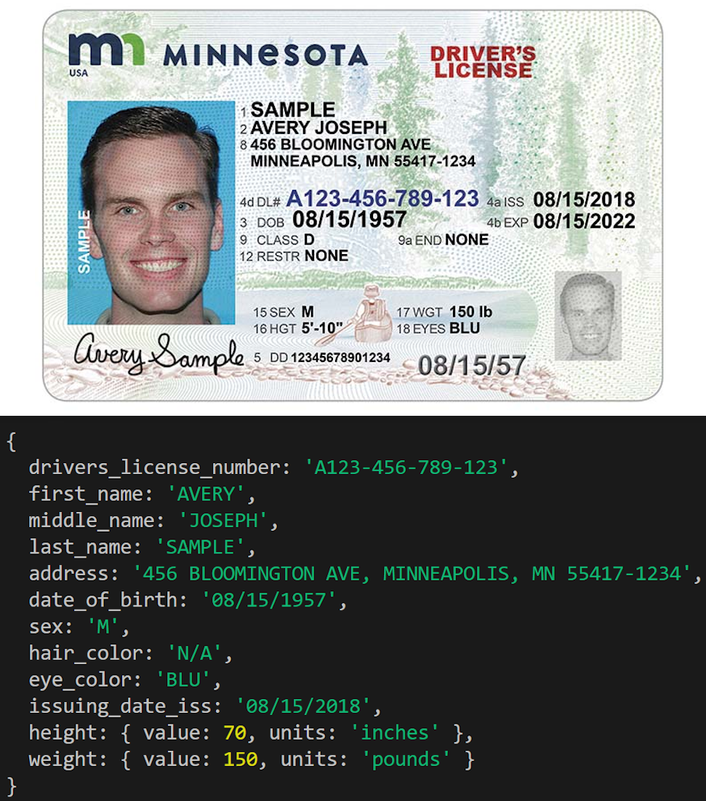
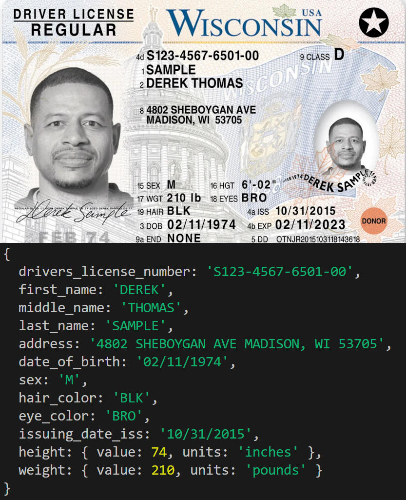

# AI Powered Driver's License Reader - Tech Demo

This project uses OpenAI's ["vision"](https://platform.openai.com/docs/guides/vision) capabilities to read and intelligently interpret the data from a photo of a Driver's License (DL) and return it in a schema-defined JSON format.

## Features

- Uses OpenAI's state-of-the-art image analysis ["vision"](https://platform.openai.com/docs/guides/vision) model.
- Schema-based structured output to **always** return valid JSON.
- Prompt engineering to clearly define tasks for the AI.

## Before Trying this Project

This code uses OpenAI's [Node package](https://www.npmjs.com/package/openai). **This means that it is NOT compatible with the [Azure OpenAI Service API.](https://learn.microsoft.com/en-us/azure/ai-services/openai/)** However, I've worked with the Azure API before and know that the code is very similar and the process is exactly the same so it should be easy to convert as needed. This code was designed to work with USA driver's licenses but can easily be reconfigured for non-USA driver's licenses as needed.

I am not responsible for any API costs incurred by executing this code.

## Setup and Execution

This project requires you to have a sufficiently funded [OpenAI account](https://openai.com/index/openai-api/) with access to any of the LATEST vision-compatible models that support structured output listed [here.](https://platform.openai.com/docs/guides/structured-outputs/supported-models) This guide will assume you have a valid OpenAI API key ready to go. An Azure API key is NOT acceptable with this code.

1. Create a `.env` file here in the root directory.
2. Define a variable for your OpenAI API key: `OPENAI_API_KEY=your_openai_api_key_here`
3. Open `DriversLicenseReader.js` in the `src` folder and locate the `exampleDriversLicenseURI` variable at the bottom of the file. It should contain a URI. If you'd like, change it to another URI of a photo/image of a driver's license. I have provided additional URIs for ease.
4. When ready, open a terminal and run `node DriversLicenseReader.js` to begin scanning a driver's license. Output will be printed to the console.

## Nuances for Implementation

There are many nuances for implementing this process in your code. This code does not do everything perfectly as it is purely a demonstration of the technology. Most of what is listed here are ways you can improve upon my code and make the tech work better for your specific use case.

### Error catching

**AI will always have a chance to be wrong no matter how simple the task is.** Driver's licenses in the USA are not aesthetically standardized and they vary state to state which could disrupt an AI trying to read the information. In my experience, informing the AI on the standardized formats has improved it's interpretation of data greatly. Think of it like a Captcha where slight lines behind the characters could make it hard to read for an AI. If you tell it how it should look, it will be more likely to interpret it that way. The biggest example of this is height where seemingly across all 50 states, the format is `5'-08"` which would indicate 5 feet and 8 inches. Another example is the DL number. While most would call it a number, it typically leads with a capital letter. In my prompts I have clearly defined standards for all collected data.

My prompt has been engineered slightly but I believe it has LOTS of room for improvement as I haven't studied every driver's license standard. I strongly believe any potential flaws can be ironed out easily.

### Extra latency when changing the schema

When changing the schema or OpenAI key, the first initial run will take extra time as the AI processes the new schema. Every run after should take less time, should be more consistent, and correlating with the file size of the uploaded image. 

### Fidelity for image understanding

API Reference. For reliably reading an image, I recommend using "auto" or "high". The "low" value, in my experience, is prone to the occasional failure. A failure with "auto" or "high" is somewhat rare provided an image of decent quality. 

### Prompt engineering

For reliable image interpretation it is crucial that the system prompt clearly informs the AI on:
- What you're showing it
- What data it should look for
- How it should interpret that data
- How to format that data (if needed, should also be defined in schema)
- Special circumstances or edge cases that may appear
- How to handle unreadable data

### Output

The output is guaranteed to be JSON and I have no doubt that it will always return JSON. However, it may not return things in consistent casing. Names or addresses may or may not be capitalized correctly. Please be aware of this and account for it accordingly. Regardless of retries, there is ALWAYS a chance for error so I recommend allowing the user to quickly verify the data is correct. There should also be failsafes in place to catch excessively low or high values. Also consider the framing of your data and how you could make it less prone to error. For example, in my code I have ChatGPT implicitly convert feet and inches to only inches. This is an example of an area where it could fail. I put this in my code to show that the AI *can* do it, not that it *should* do it.

## Author
Code written by [Josh Baldwin](https://github.com/JoshBaldwin101).

Contact me:
joshbaldwin101@gmail.com

Use this code however you like. 

## More Examples

**Example 1**

**Example 2**

**Example 3**

**Example 4**

